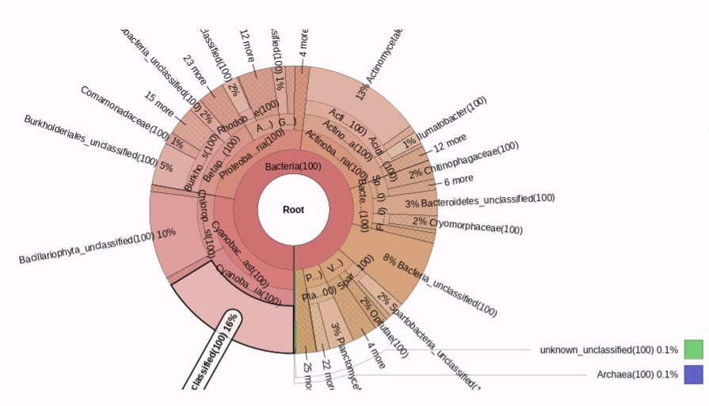
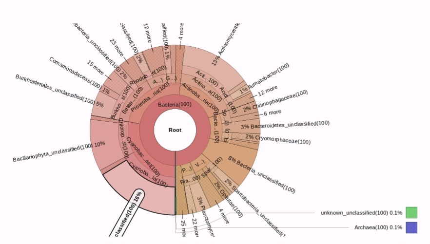

# 🔬 16S rRNA Amplicon Microbial Diversity Analysis report 

**16S rRNA amplicon analysis of fresh water sample obtained from Nile river in Downtown area**

**Project Type:** Metagenomics / Bioinformatics  
**Last Updated:** 14-03-2026

---

# Team

* **Dr. Mai Abdel-Wahed**  
  Lecturer of Microbiology and Immunology   
  Faculty of Pharmacy – Modern Sciences and Arts University (MSA), Egypt
  
* **Mohamed H. Hussein**   
  M.Sc Candidate – Biochemistry & Molecular Biology   
  Ain Shams University, Egypt
  
* **Amr Abdel-Hamid El-Sayed**  
  M.Sc Candidate – Biochemistry & Molecular Biology  
  Teaching Assistant – Ain Shams University, Egypt
 
* **Sohaila El-Sayed**   
  Senior Student – Applied Biotechnology    
  Nile University, Egypt

* **Nancy Shehta Bahi**   
  Student – Applied Biotechnology    
  Nile University, Egypt
  
*Note: This report was prepared by Mohamed H. Hussein and documents the workflow implementation and analysis in which I actively participated as a contributing member of the project team. While the project was conducted collaboratively, I was directly involved in performing the analyses and compiling the results. All steps and commands are fully documented for educational purposes and reproducibility.*

---

# Resources

## Sequencing Dataset

The 16S rRNA amplicon sequencing dataset used in this project was retrieved from the **NCBI Sequence Read Archive (SRA)**, a public repository that stores raw next-generation sequencing data for biological research.

**BioProject Accession**

```
PRJNA475592
```

NCBI BioProject Page:

[https://www.ncbi.nlm.nih.gov/bioproject/PRJNA475592](https://www.ncbi.nlm.nih.gov/bioproject/PRJNA475592)

Direct SRA Study Page:

[https://www.ncbi.nlm.nih.gov/Traces/study/?acc=SRP150523](https://www.ncbi.nlm.nih.gov/Traces/study/?acc=SRP150523)

---

## Individual Sequencing Runs

The following sequencing runs were used in the analysis:

| Run Accession | Season | Read Type | Download Link                                                                                                          |
| ------------- | ------ | --------- | ---------------------------------------------------------------------------------------------------------------------- |
| SRR7341891    | Winter | Forward   | [https://trace.ncbi.nlm.nih.gov/Traces/sra/?run=SRR7341891](https://trace.ncbi.nlm.nih.gov/Traces/sra/?run=SRR7341891) |
| SRR7341891    | Winter | Reverse   | [https://trace.ncbi.nlm.nih.gov/Traces/sra/?run=SRR7341891](https://trace.ncbi.nlm.nih.gov/Traces/sra/?run=SRR7341891) |
| SRR7341886    | Summer | Forward   | [https://trace.ncbi.nlm.nih.gov/Traces/sra/?run=SRR7341886](https://trace.ncbi.nlm.nih.gov/Traces/sra/?run=SRR7341886) |
| SRR7341886    | Summer | Reverse   | [https://trace.ncbi.nlm.nih.gov/Traces/sra/?run=SRR7341886](https://trace.ncbi.nlm.nih.gov/Traces/sra/?run=SRR7341886) |

---

## FASTQ Download (ENA Mirror)

Raw FASTQ files can also be downloaded from the **European Nucleotide Archive (ENA)**:

Winter sample:

[https://www.ebi.ac.uk/ena/browser/view/SRR7341891](https://www.ebi.ac.uk/ena/browser/view/SRR7341891)

Summer sample:

[https://www.ebi.ac.uk/ena/browser/view/SRR7341886](https://www.ebi.ac.uk/ena/browser/view/SRR7341886)

---
### Reference Paper (Primary Publication for Dataset)  
The datasets used in this project were originally generated and published by:  

Eraqi, W. A., ElRakaiby, M. T., Megahed, S. A., Yousef, N. H., Elshahed, M. S., & Yassin, A. S. (2018). *The Nile River Microbiome Reveals a Remarkably Stable Community Between Wet and Dry Seasons, and Sampling Sites, in a Large Urban Metropolis (Cairo, Egypt).* OMICS: A Journal of Integrative Biology, 22(8), 553‑564.  
DOI: [10.1089/omi.2018.0090](https://doi.org/10.1089/omi.2018.0090)

---

## Galaxy Workflow History

The bioinformatics analysis was performed using the **Galaxy platform**.

Team analysis history:

[https://usegalaxy.org/u/esohila04/h/copy-of-unnamed-history](https://usegalaxy.org/u/esohila04/h/copy-of-unnamed-history)

Galaxy Platform:

[https://usegalaxy.org/](https://usegalaxy.org/)

---

## Visualization Tool

Taxonomic abundance visualization was generated using:

**Krona**

[https://github.com/marbl/Krona/wiki](https://github.com/marbl/Krona/wiki)

---

# Table of Contents

- [I. Objective](#i-objective)
- [II. Introduction](#ii-introduction)
- [III. Dataset Description](#iii-dataset-description)
- [IV. Bioinformatics Tools](#iv-bioinformatics-tools)
- [V. Amplicon Analysis Workflow](#v-amplicon-analysis-workflow)
- [VI. Quality Control and Filtering](#vi-quality-control-and-filtering)
- [VII. OTU Clustering and Taxonomic Classification](#vii-otu-clustering-and-taxonomic-classification)
- [VIII. Results and Visualization](#viii-results-and-visualization)
- [IX. Interpretation of Results](#IX-Interpretation-of-Results)
- [X. Conclusion](#x-conclusion)


---

# I. Objective

The aim of this project is to investigate the **impact of seasonal variation on microbial communities in freshwater environments** using **16S rRNA amplicon sequencing**.

Specifically, the analysis focuses on:

* Assessing **microbial abundance**
* Evaluating **microbial diversity**
* Comparing **summer and winter microbial profiles**

---

# II. Introduction

Microbial communities play a critical role in aquatic ecosystems, influencing nutrient cycling, water quality, and ecological balance.

**16S rRNA amplicon sequencing** is a widely used technique for profiling microbial diversity. By targeting conserved regions of the 16S ribosomal RNA gene, researchers can identify bacterial taxa present in environmental samples.

This project demonstrates a **bioinformatics pipeline for microbial community analysis** using publicly available sequencing datasets and the Galaxy platform.

---

# III. Dataset Description

The dataset consists of **16S rRNA amplicon sequences** obtained from freshwater samples.

Data were retrieved from the **Sequence Read Archive (SRA)** under accession number:

```
SRP150523
```

The dataset contains samples representing different seasons:

* **Winter sample**
* **Summer sample**

These seasonal datasets allow comparison of microbial community structure across environmental conditions.

---

# IV. Bioinformatics Tools

The analysis was performed using the **Galaxy bioinformatics platform**.

Tools used include:

| Tool           | Purpose                    |
| -------------- | -------------------------- |
| Upload Manager | Import datasets            |
| Merge.files    | Merge paired reads         |
| Make.group     | Create sample groups       |
| Unique.seqs    | Remove duplicate sequences |
| Count.seqs     | Count sequence abundance   |
| Summary.seqs   | Sequence statistics        |
| Screen.seqs    | Quality filtering          |
| Align.seqs     | Sequence alignment         |
| Filter.seqs    | Remove gaps                |
| Pre.cluster    | Reduce sequencing errors   |
| Classify.seqs  | Taxonomic classification   |
| Cluster.split  | OTU clustering             |
| Make.shared    | OTU abundance table        |
| Krona          | Taxonomic visualization    |

---

# V. Amplicon Data Analysis Workflow

The workflow consists of multiple steps for **sequence preprocessing, filtering, alignment, and clustering**.

### 1 Data Import and Preparation

* Import raw sequencing reads
* Merge paired reads
* Generate group files

### 2 Initial Optimization and QC

* Remove duplicate sequences
* Count sequence abundance

### 3 Quality Control and Filtering

* Generate sequence summaries
* Filter low-quality sequences

### 4 Sequence Alignment

* Align sequences against reference databases
* Evaluate alignment statistics
* Remove poorly aligned reads

### 5 OTU Clustering and Taxonomic Classification

* Pre-cluster highly similar sequences
* Assign taxonomy
* Cluster sequences into OTUs

### 6 Visualization

* Generate taxonomic abundance visualizations using **Krona**

---

# VI. Quality Control and Filtering

The following parameters were used during sequence filtering:

| Parameter | Value |
| --------- | ----- |
| minlength | 291   |
| maxlength | 294   |
| maxambig  | 0     |
| maxhomop  | 8     |

Initial filtering results:

| Category   | Reads  |
| ---------- | ------ |
| Good reads | 56,652 |
| Bad reads  | 15,230 |

After alignment and additional filtering:

| Category   | Reads  |
| ---------- | ------ |
| Good reads | 54,763 |
| Bad reads  | 1,889  |

---

# VII. OTU Clustering

After the **pre-clustering step**, the dataset contained:

```
36,325 reads
```

Example OTU annotation:

| OTU      | Size  | Taxonomy                               |
| -------- | ----- | -------------------------------------- |
| OTU00001 | 16176 | Bacteria → Cyanobacteria / Chloroplast |

---

### VIII. Results and Visualization

Taxonomic composition of microbial communities was visualized using **Krona pie charts**.

#### Figure 1: Overall Microbial Abundance Winter 

Taxonomic composition across all reads.



#### Figure 2: Per-Sample Microbial Composition

Comparison of microbial taxa between seasonal samples.



---

# IX. Interpretation of Results

The microbial community was dominated by members of the domain Bacteria. At the phylum level, the most abundant taxa included **Actinobacteria, Proteobacteria, Bacteroidetes, Cyanobacteria, and Bacillariophyta**.

Several bacterial groups were also classified as **unclassified taxa**, indicating potential unexplored diversity. In addition, **Archaea were detected at very low abundance (~0.1%)**.

These microbial groups are commonly observed in freshwater ecosystems and their relative abundance may vary depending on environmental conditions such as temperature, nutrient availability, and seasonal variation.

---

# X. Conclusion

This project demonstrates a **complete 16S rRNA amplicon analysis workflow** for microbial community profiling using the Galaxy platform.

Key outcomes include:

* Successful **quality control and filtering** of sequencing data
* Generation of **OTU clusters for microbial classification**
* Visualization of **taxonomic abundance using Krona plots**
* Identification of dominant microbial taxa in freshwater samples

The workflow provides a **documented framework for metagenomic microbial diversity analysis** and can be applied to additional environmental datasets.

