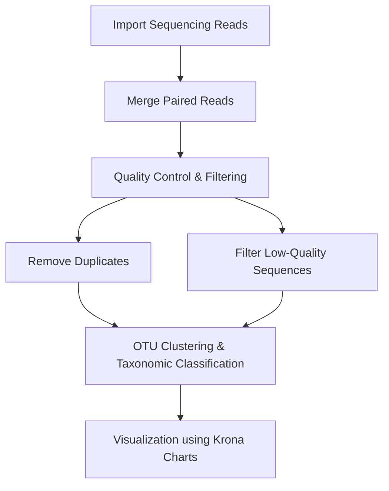

# 🔬 16S rRNA Amplicon Microbial Diversity Analysis — Nile River Freshwater Microbiome

<div align="center">
    
This folder documents the **full analysis of microbial diversity in Nile River freshwater samples** using **16S rRNA amplicon sequencing**, including documented workflows, visualizations, and comprehensive reporting.
</div>

---

## 🌱 Project Overview

This project investigates **microbial community composition** in freshwater samples from the Nile River (Downtown Cairo). Using **16S rRNA amplicon sequencing**, we assessed seasonal variation (Winter vs. Summer) and generated insights into microbial diversity patterns.



---

## 📂 Folder Structure

```
16S-rRNA-Amplicon-Microbial-Diversity-Analysis/
│
├── README.md  
├── 16S-rRNA-Amplicon-Microbial-Diversity-Analysis-report.md  # Full report
├── 16S-rRNA-Amplicon-Microbial-Diversity-Presentation.pdf  # Presentation slides
└── figures/                  # Krona charts and other visualizations
    ├── Pie_chart_visualization_for_overall_abundance_Winter.png
    └── Pie_chart_visualization_for_each_sample_Summer.png
```

---

## 📁 Project Contents

| File / Folder                                            | Description                                 | Link                                                                        |
| -------------------------------------------------------- | ------------------------------------------- | --------------------------------------------------------------------------- |
| `16S-rRNA-Amplicon-Microbial-Diversity-Analysis-report.md`      | Full analysis report                        | [View Report](16S-rRNA-Amplicon-Microbial-Diversity-Analysis-report.md)            |
| `16S-rRNA-Amplicon-Microbial-Diversity-Presentation.pdf` | Summary presentation of results and figures | [View Presentation](16S-rRNA-Amplicon-Microbial-Diversity-Presentation.pdf) |
| `figures/`                                               | Visualizations generated from OTU analysis  | [View Figures](figures/)                                                    |

---

## 🔗 Workflow & Resources

| Resource               | Description                                                | Link                                                                                                                      |
| ---------------------- | ---------------------------------------------------------- | ------------------------------------------------------------------------------------------------------------------------- |
| Galaxy Project History | Full sequence QC, OTU clustering, taxonomic classification | [Galaxy History](https://usegalaxy.org/u/esohila04/h/copy-of-unnamed-history)                                             |
| SRA Winter Sample      | Forward & Reverse sequencing reads                         | [SRR7341891](https://trace.ncbi.nlm.nih.gov/Traces/sra/?run=SRR7341891)                                                   |
| SRA Summer Sample      | Forward & Reverse sequencing reads                         | [SRR7341886](https://trace.ncbi.nlm.nih.gov/Traces/sra/?run=SRR7341886)                                                   |
| ENA Mirror             | Direct FASTQ download                                      | [Winter](https://www.ebi.ac.uk/ena/browser/view/SRR7341891) / [Summer](https://www.ebi.ac.uk/ena/browser/view/SRR7341886) |
| Reference Paper        | Original publication describing dataset                    | [Eraqi et al., 2018](https://doi.org/10.1089/omi.2018.0090)                                                               |

---

## 📊 Dataset Summary

| Feature                  | Description                                                                   |
| ------------------------ | ----------------------------------------------------------------------------- |
| Sample Source            | Nile River, Downtown Cairo, Egypt                                             |
| Seasons                  | Winter, Summer                                                                |
| Sequencing Method        | 16S rRNA amplicon sequencing                                                  |
| Number of Reads          | Winter: 56,652 <br> Summer: 36,325 (after pre-clustering)                     |
| Tools / Platform         | Galaxy Platform, Krona, OTU clustering pipelines                              |
| Key Microbial Phyla      | Actinobacteria, Proteobacteria, Bacteroidetes, Cyanobacteria, Bacillariophyta |
| Visualization            | Krona Pie Charts, per-sample abundance charts                                 |
| Quality Filtering Params | minlength=291, maxlength=294, maxambig=0, maxhomop=8                          |

---

## 🌟 Relevance to My Field


As an MSc candidate in Biochemistry & Molecular Biology, specializing in Molecular Cancer Biology and Bioinformatics, this **16S rRNA Amplicon Microbial Diversity Analysis project** provided:

* Hands-on experience with **microbial community profiling and biodiversity analysis** in environmental samples.
* Practical skills in **sequence quality control, OTU clustering, and taxonomic classification** using Galaxy workflows.
* Experience in **visualizing complex microbial datasets** with Krona charts and per-sample abundance plots.
* Training in **Documentation of bioinformatics workflows**, ensuring transparency and replicability of results.
* Exposure to **linking raw sequencing data with processed outputs**, including reports and interactive visualizations.
* Development of critical reasoning for **interpreting microbial diversity patterns and their potential biological significance**.

This training strengthened my ability to **integrate experimental and computational microbiome analysis**, directly relevant to **studying microbial interactions in human health, exploring tumor microbiomes, RNA-based datasets, and applying bioinformatics to molecular cancer biology research**.

---

## 🧠 Skills Acquired

| Category             | Skills                                                                                                       |
| -------------------- | ------------------------------------------------------------------------------------------------------------ |
| Bioinformatics       | Galaxy workflow execution, OTU clustering, sequence filtering, taxonomic classification, Krona visualization |
| Data Analysis        | Microbial abundance calculation, diversity comparison, interpretation of phylum-level data                   |
| Computational        | Documented workflow creation, QC parameter selection                               |
| Scientific Reporting | Report writing, figure annotation, linking raw data to results, presentation preparation                     |

---

## Team

| Name                     | Affiliation                                                                          |
| ------------------------ | ------------------------------------------------------------------------------------ |
| Dr. Mai Abdel-Wahed      | Lecturer of Microbiology and Immunology, Faculty of Pharmacy – MSA University, Egypt |
| Mohamed H. Hussein       | M.Sc. Candidate, Biochemistry & Molecular Biology, Ain Shams University, Egypt       |
| Amr Abdel-Hamid El-Sayed | M.Sc. Candidate & Teaching Assistant, Ain Shams University, Egypt                    |
| Sohaila El-Sayed         | Senior Student, Applied Biotechnology, Nile University, Egypt                        |
| Nancy Shehta Bahi        | Student, Applied Biotechnology, Nile University, Egypt                               |

---

## Author Contribution

**Mohamed H. Hussein**    
M.Sc. Candidate, Biochemistry & Molecular Biology, Ain Shams University, Egypt

**Contributed to both collaborative and independent efforts throughout this project:**

**Collaborative contributions:**

* Acquired raw sequencing data from **SRA/ENA**.
* Performed **sequence preprocessing and quality control**.
* Conducted **OTU clustering and taxonomic classification**.
* Generated **Krona visualizations** to illustrate microbial abundance.
* Assisted in **preparing the presentation** summarizing results.

**Independent contributions:**

* Compiled the **full project report**, documenting each analysis step.
* Documented the **entire workflow and outputs on GitHub**, including README, report, figures, and presentation files, ensuring transparency.


---

## 📝 Citation & Usage

This folder is part of the **Research-Trainings-2025** repository.

**Citation:**

Hussein, Mohamed H. (2026). *Research-Trainings-2026 repository [Summary, Notes, and Project]*. GitHub repository: [https://github.com/Mohamed-H-Hussein/Research-Trainings-2025](https://github.com/Mohamed-H-Hussein/Research-Trainings-2025)

---

## ⚖️ License

[](https://creativecommons.org/licenses/by-nc/4.0/)

This folder is licensed under the **Creative Commons Attribution-NonCommercial 4.0 International License (CC BY-NC 4.0)**. 
Full license: [https://creativecommons.org/licenses/by-nc/4.0/legalcode](https://creativecommons.org/licenses/by-nc/4.0/legalcode)

---

© 2026 Mohamed H. Hussein. All documented workflow are provided "as is" without warranty.
