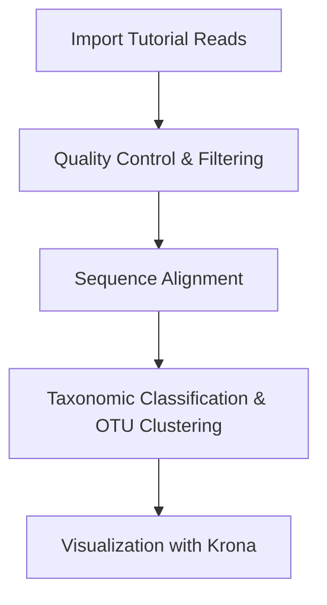

# 🔬 16S rRNA Amplicon Microbial Diversity Analysis — Tutorial Bioinformatics Workflow

<div align="center">
    
This folder documents the **detailed tutorial workflow for analyzing microbial diversity** using **16S rRNA amplicon sequencing**, part of the **African Biogenome Training Series 2025**. It includes step-by-step instructions, reproducible Galaxy workflows, and hands-on learning exercises.
</div>

---

## 🌱 Project Overview

This tutorial provides a **comprehensive hands-on guide** for analyzing microbial communities from 16S rRNA amplicon sequencing datasets. Participants learn to process raw sequences, perform quality control, cluster OTUs, assign taxonomy, and visualize microbial abundance patterns using **Galaxy workflows**.

**Key learning objectives:**

* Gain practical experience in microbial bioinformatics workflows.
* Understand quality control and OTU clustering principles.
* Visualize taxonomic composition interactively with Krona.
* Apply workflows to real or tutorial datasets for reproducible analysis.



---

## 📂 Folder Structure

```
Tutorial-Bioinformatics-Workflow/
│
├── README.md
└── 16S-rRNA-Amplicon-Tutorial-Workflow.md   # Full step-by-step tutorial report
```

---

## 📁 Project Contents

| File / Folder                            | Description                                 | Link                                                             |
| ---------------------------------------- | ------------------------------------------- | ---------------------------------------------------------------- |
| `README.md`                              | Overview of tutorial workflow               | [View README](README.md)                                         |
| `16S-rRNA-Amplicon-Tutorial-Workflow.md` | Detailed tutorial report and workflow steps | [View Tutorial Workflow](16S-rRNA-Amplicon-Tutorial-Workflow.md) |

---

## 🔗 Workflow & Resources

| Resource                 | Description                                          | Link                                                                                                                                          |
| ------------------------ | ---------------------------------------------------- | --------------------------------------------------------------------------------------------------------------------------------------------- |
| Galaxy Training History  | Full tutorial Galaxy workflow with all tools & steps | [Galaxy History Link](https://usegalaxy.eu/u/mohamed_h.hussien/h/africanbiogenome-workshop-2025)                                              |
| Tutorial Sample: Pampa   | Soil sample 16S rRNA V4 region                       | [SRR531818_pampa.fasta](https://zenodo.org/record/815875/files/SRR531818_pampa.fasta)                                                         |
| Tutorial Sample: Anguil  | Soil sample 16S rRNA V4 region                       | [SRR651839_anguil.fasta](https://zenodo.org/record/815875/files/SRR651839_anguil.fasta)                                                       |
| SILVA Reference Database | 16S rRNA alignment reference                         | [silva.v4.fasta](https://zenodo.org/record/815875/files/silva.v4.fasta)                                                                       |
| GTN 16S Tutorial         | Galaxy Training Network tutorial for reference       | [16S Data Analysis Tutorial](https://training.galaxyproject.org/training-material/topics/microbiome/tutorials/general-tutorial/tutorial.html) |


---

## Relevance to My Field

As an MSc candidate in Biochemistry & Molecular Biology, specializing in Molecular Cancer Biology and Bioinformatics, this **16S rRNA tutorial workflow** provided:

* Hands-on experience with **microbial community profiling and 16S amplicon sequencing workflows**.
* Practical skills in **sequence quality control, OTU clustering, and taxonomic classification**.
* Experience in **visualizing complex microbial datasets** using Krona and other bioinformatics tools.
* Training in **reproducible bioinformatics workflows** using Galaxy, ensuring transparency and replication.
* Exposure to **linking raw sequence data with outputs**, including interactive visualizations and reports.
* Development of critical reasoning for **interpreting microbial diversity patterns and their potential biological implications**.

This training strengthened my ability to **integrate experimental and computational microbiome analysis**, directly relevant to **studying tumor microbiomes, RNA-based datasets, and applying bioinformatics to molecular cancer biology research**.

---

## 🧠 Skills Acquired

| Category             | Skills                                                                                                   |
| -------------------- | -------------------------------------------------------------------------------------------------------- |
| Bioinformatics       | Galaxy workflow execution, sequence import, QC, OTU clustering, taxonomy assignment, Krona visualization |
| Data Analysis        | Sequence filtering, diversity metrics calculation, interpretation of microbial abundance                 |
| Computational        | Workflow documentation, reproducibility, parameter optimization                                          |
| Scientific Reporting | Compiling tutorial reports, linking workflow steps to outputs, figure annotation                         |

---

## 🌟 Significance & Applications

* Provides **hands-on training in microbial bioinformatics**, supporting students and researchers.
* Emphasizes **reproducible workflows** using **Galaxy**, aligning with international best practices.
* Applicable for **environmental microbiome studies**, **soil microbial diversity**, and **tutorial-based learning**.
* Knowledge and workflow principles can translate to **RNA-based or tumor microbiome datasets**.

---

## Acknowledgment

We sincerely thank the workshop instructors who facilitated **hands-on sessions** for the African Biogenome Training Series 2025:

| Name                 | Affiliation                                                         |
| -------------------- | ------------------------------------------------------------------- |
| Assem Kadry Elsherif | Assistant Lecturer, School of Biotechnology, Nile University, Egypt |
| Shaimaa R. Reda      | Assistant Lecturer, School of Biotechnology, Nile University, Egypt |

> Their guidance during the practical sessions allowed participants to **fully understand and implement the tutorial workflow**, from raw sequence import to taxonomic visualization.

---

## Author Contribution

**Mohamed H. Hussein**
M.Sc. Candidate, Biochemistry & Molecular Biology, Ain Shams University, Egypt

* Implemented and documented the **tutorial workflow**.
* Compiled and formatted the **step-by-step tutorial report**.
* Linked tutorial datasets, Galaxy history, and visualization outputs for reproducibility.

---

## 📝 Citation & Usage

This tutorial is part of the **Research-Trainings-2025** repository.

**Citation:**
Hussein, Mohamed H. (2026). *Research-Trainings-2026 repository [Summary, Notes, and Project]*. GitHub repository: [https://github.com/Mohamed-H-Hussein/Research-Trainings-2025](https://github.com/Mohamed-H-Hussein/Research-Trainings-2025)


---

## ⚖️ License

[](https://creativecommons.org/licenses/by-nc/4.0/)

This folder is licensed under the **Creative Commons Attribution-NonCommercial 4.0 International License (CC BY-NC 4.0)**.
Full license: [https://creativecommons.org/licenses/by-nc/4.0/legalcode](https://creativecommons.org/licenses/by-nc/4.0/legalcode)

---

© 2026 Mohamed H. Hussein. All tutorial workflows are provided "as is" without warranty.

